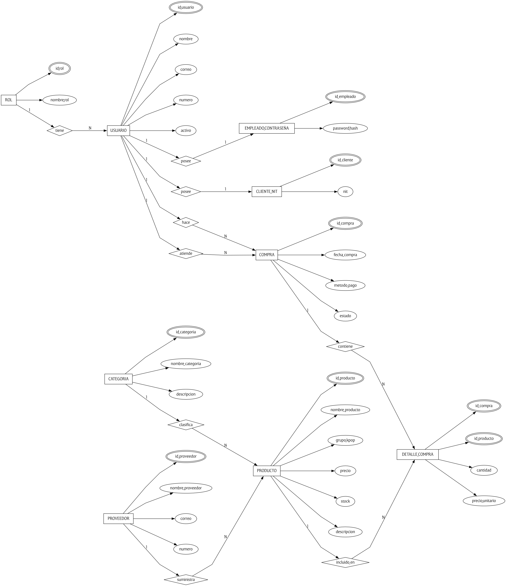

# KStore Galaxy

Sistema web para una tienda de K-pop: inventario, ventas, clientes, equipo, proveedores y reportes SQL reales. El proyecto usa PostgreSQL, backend con Elysia, frontend con Ripple y despliegue con Docker Compose.

## Inicio rapido

```bash
cp .env.example .env
docker compose up --build
```

Abrir:

- Frontend: http://localhost:5173
- API: http://localhost:3000/api/health
- Documentacion API: http://localhost:3000/reference

Credenciales para prueba:

- Admin: `emily@kstoregalaxy.gt` / `admin123`
- Empleado: `luis.angel@kstoregalaxy.gt` / `empleado123`

Si ya habias levantado una version anterior, recrea los datos:

```bash
docker compose down -v
docker compose up --build
```

## Que se puede hacer

- Iniciar y cerrar sesion.
- Crear, editar y eliminar productos solo con cuenta administradora.
- Crear, editar y eliminar categorias solo con cuenta administradora.
- Crear clientes desde cualquier cuenta de empleado.
- El NIT de cliente es opcional.
- Crear empleados y proveedores solo con rol alto: Administrador, Supervisor o Gerente.
- Registrar ventas con descuento de inventario dentro de una transaccion explicita.
- Ver reportes SQL desde la UI y exportar el resumen a CSV.
- Ver errores y validaciones directamente en pantalla.

## Reportes incluidos

- Ventas por producto: productos vendidos con unidades, compras e ingresos.
- Inventario por proveedor: una fila por proveedor con unidades y valor del inventario.
- Historial de clientes: consulta con JOIN de cliente, NIT, empleado y compra.
- Alertas de stock: consulta con subquery contra el promedio.
- Clientes frecuentes: clientes con dos o mas compras y conteo total de compras.
- Categorias estrella: `GROUP BY`, `HAVING`, `COUNT` y `SUM`.
- Resumen de ventas: consulta alimentada por `vista_resumen_ventas`.

## Base de datos

Credenciales obligatorias de la rubrica:

- Usuario: `proy2`
- Password: `secret`
- Base de datos: `kpop_store`

`database/db.sql` contiene DDL, claves primarias, claves foraneas, `NOT NULL`, checks, indices, vista y datos de prueba.

### Diagrama ER


## Estructura

```text
.
├── backend/                 # API Elysia con SQL explicito
├── frontend/                # UI Ripple + Vite
├── database/                # Script SQL principal
├── docs/                    # Modelo relacional, 3FN, ER y consultas
├── database/db.sql          # DDL, indices, vista y datos
├── diagrama_er.dot          # Codigo DOT del Diagrama ER (Graphviz)
├── docker-compose.yml
├── .env
└── .env.example
```